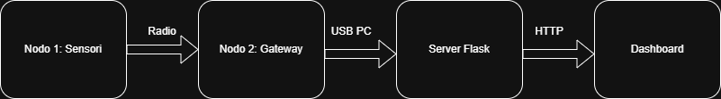

# Safe Desk

**IoT system for real-time indoor environment monitoring.**

Safe Desk is a university project developed using **micro:bit**, sensors, wireless communication, and a **Flask web server**.

The system monitors **temperature and distance**, detects potentially unsafe conditions, and displays the collected data through a web dashboard.

## Architecture

## Hardware

* 2 × micro:bit
* HC-SR04 Ultrasonic Sensor
* TMP36 Temperature Sensor
* I2C LCD Display
* Breadboard and jumper wires

## Main Features

* 🌡️ Temperature monitoring
* 📏 Distance monitoring
* 📡 Wireless communication between micro:bits
* ⚠️ Safety alerts
* 🌐 Flask web dashboard
* 📊 Real-time data visualization

## Technologies

**Python · Flask · Chart.js · micro:bit · Radio Communication**

## Authors

**Tommaso Babbuini & Andrea Jovani**
Department of Mathematics and Computer Science – University of Perugia
Academic Year 2025/2026
